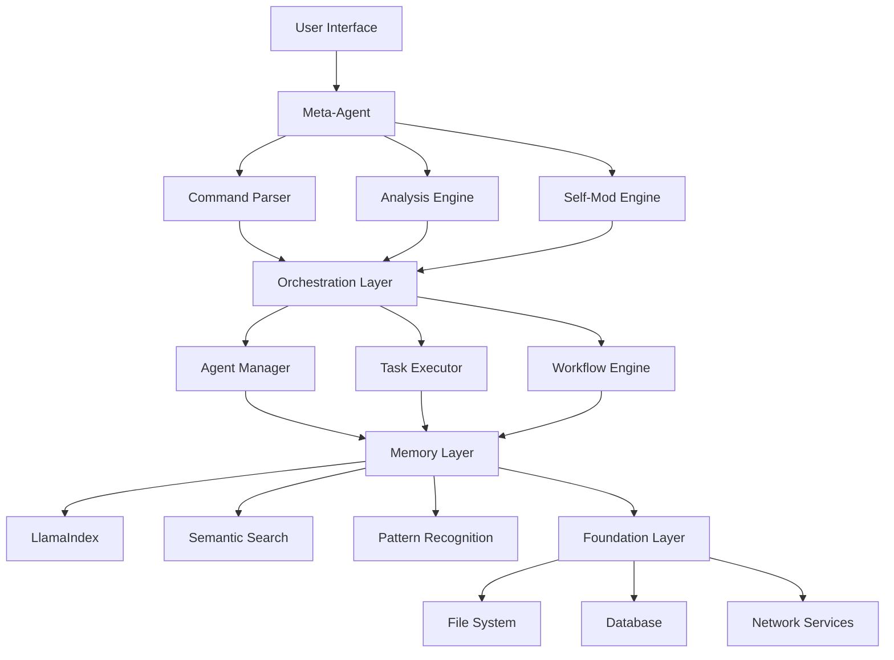
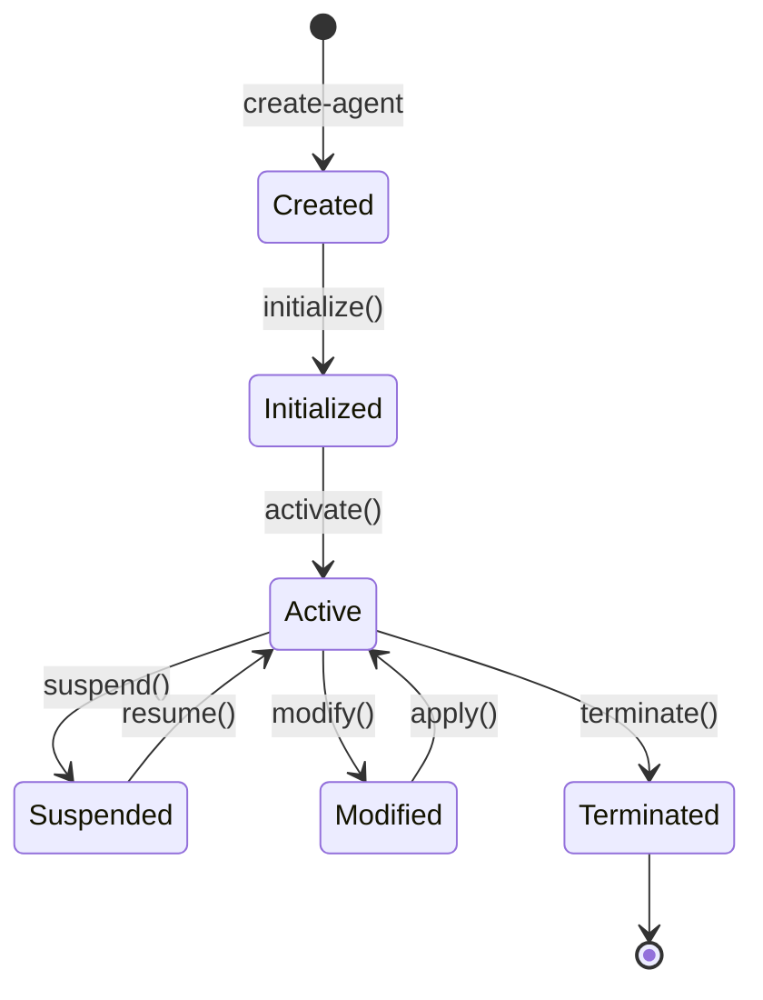
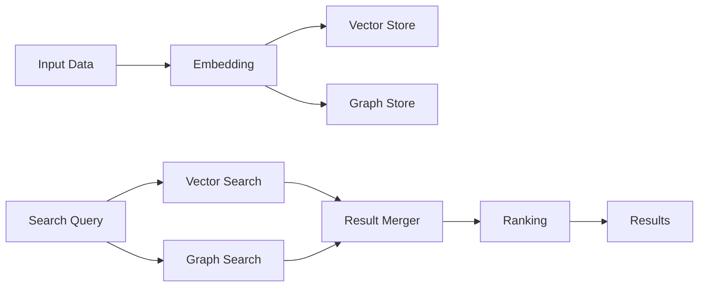
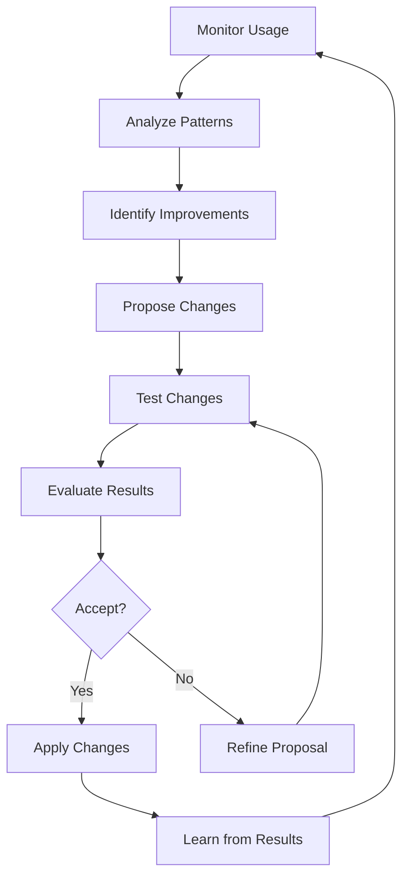
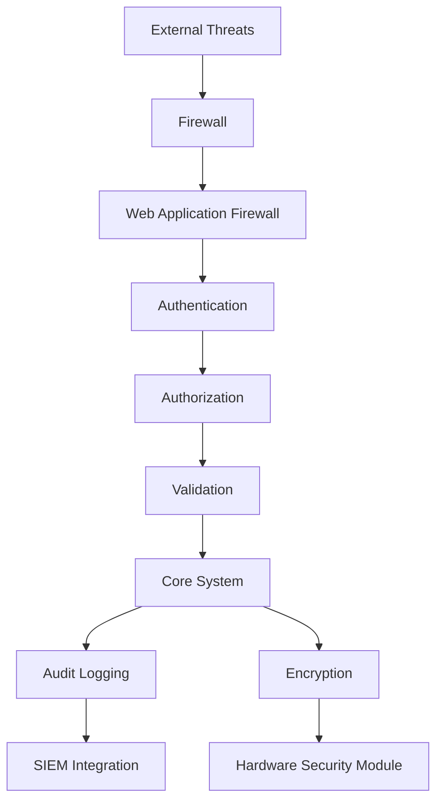
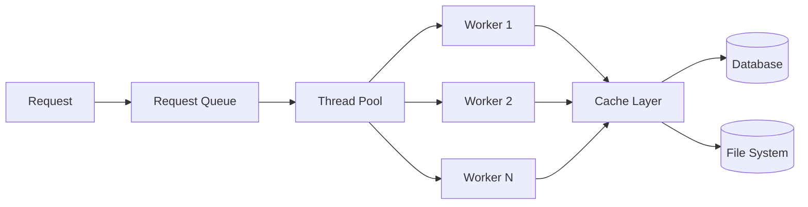

# AIOS-FULLSTACK Architecture Overview

## Table of Contents

1. [Introduction](#introduction)
2. [System Architecture](#system-architecture)
3. [Core Components](#core-components)
4. [Meta-Agent Architecture](#meta-agent-architecture)
5. [Memory Layer Design](#memory-layer-design)
6. [Self-Modification System](#self-modification-system)
7. [Security Architecture](#security-architecture)
8. [Performance Design](#performance-design)
9. [Extension System](#extension-system)
10. [Deployment Architecture](#deployment-architecture)

## Introduction

AIOS-FULLSTACK is built on a revolutionary self-modifying architecture that enables AI-driven development with unprecedented capabilities. This document provides a comprehensive overview of the system's technical architecture.

### Design Principles

1. **Self-Awareness**: The system understands its own structure and capabilities
2. **Adaptive Evolution**: Components can modify and improve themselves
3. **Contextual Intelligence**: Deep understanding through semantic memory
4. **Modular Extensibility**: Plugin-based architecture for infinite expansion
5. **Security First**: Built-in security at every layer
6. **Performance Optimized**: Efficient resource utilization

## System Architecture

### High-Level Overview

```
┌─────────────────────────────────────────────────────────────┐
│                        User Interface                        │
│                   (CLI / API / Web Dashboard)               │
└─────────────────────┬───────────────────────────────────────┘
                      │
┌─────────────────────▼───────────────────────────────────────┐
│                      Meta-Agent Core                         │
│  ┌─────────────┐  ┌──────────────┐  ┌──────────────────┐  │
│  │   Command   │  │   Analysis   │  │  Self-Modification│  │
│  │   Parser    │  │   Engine     │  │     Engine       │  │
│  └─────────────┘  └──────────────┘  └──────────────────┘  │
└─────────────────────┬───────────────────────────────────────┘
                      │
┌─────────────────────▼───────────────────────────────────────┐
│                    Orchestration Layer                       │
│  ┌─────────────┐  ┌──────────────┐  ┌──────────────────┐  │
│  │    Agent    │  │     Task     │  │    Workflow      │  │
│  │   Manager   │  │   Executor   │  │     Engine       │  │
│  └─────────────┘  └──────────────┘  └──────────────────┘  │
└─────────────────────┬───────────────────────────────────────┘
                      │
┌─────────────────────▼───────────────────────────────────────┐
│                      Memory Layer                            │
│  ┌─────────────┐  ┌──────────────┐  ┌──────────────────┐  │
│  │  LlamaIndex │  │   Semantic   │  │    Pattern       │  │
│  │    Core     │  │    Search    │  │   Recognition    │  │
│  └─────────────┘  └──────────────┘  └──────────────────┘  │
└─────────────────────┬───────────────────────────────────────┘
                      │
┌─────────────────────▼───────────────────────────────────────┐
│                    Foundation Layer                          │
│  ┌─────────────┐  ┌──────────────┐  ┌──────────────────┐  │
│  │    File     │  │   Database   │  │     Network      │  │
│  │   System    │  │   Storage    │  │    Services      │  │
│  └─────────────┘  └──────────────┘  └──────────────────┘  │
└─────────────────────────────────────────────────────────────┘
```

### Component Interactions



## Core Components

### 1. Meta-Agent Core

The heart of AIOS-FULLSTACK, responsible for:

- **Command Processing**: Parsing and understanding user intentions
- **Context Building**: Gathering relevant information for operations
- **Decision Making**: Choosing appropriate actions and agents
- **Execution Coordination**: Managing complex multi-step operations

```javascript
class MetaAgentCore {
  constructor() {
    this.commandParser = new CommandParser();
    this.analysisEngine = new AnalysisEngine();
    this.selfModEngine = new SelfModificationEngine();
    this.contextManager = new ContextManager();
  }

  async processCommand(command) {
    // 1. Parse command
    const parsed = await this.commandParser.parse(command);
    
    // 2. Build context
    const context = await this.contextManager.buildContext(parsed);
    
    // 3. Analyze requirements
    const analysis = await this.analysisEngine.analyze(context);
    
    // 4. Execute action
    return await this.executeAction(analysis);
  }
}
```

### 2. Orchestration Layer

Manages the coordination between different system components:

- **Agent Manager**: Lifecycle management for AI agents
- **Task Executor**: Runs individual tasks with proper isolation
- **Workflow Engine**: Orchestrates complex multi-step workflows

### 3. Memory Layer

Powered by LlamaIndex for intelligent information retrieval:

- **Vector Storage**: Semantic embeddings of code and documentation
- **Graph Relationships**: Understanding connections between components
- **Temporal Tracking**: Learning from historical patterns

### 4. Foundation Layer

Low-level services and abstractions:

- **File System Operations**: Safe, transactional file handling
- **Database Storage**: Persistent configuration and state
- **Network Services**: API integrations and external communications

## Meta-Agent Architecture

### Agent Lifecycle



### Agent Structure

```yaml
# Agent Definition Schema
name: agent-name
version: 1.0.0
type: assistant|analyzer|generator|specialist

metadata:
  author: system|user
  created: timestamp
  modified: timestamp
  
capabilities:
  - name: capability-name
    description: What this capability does
    parameters:
      - name: param-name
        type: string|number|boolean|object
        required: true|false
        default: value
        
instructions: |
  Behavioral guidelines for the agent
  
triggers:
  - type: command|event|schedule
    pattern: trigger-pattern
    
hooks:
  - type: before|after
    event: event-name
    handler: handler-function
```

### Agent Communication

Agents communicate through a message-passing system:

```javascript
class AgentCommunication {
  async sendMessage(fromAgent, toAgent, message) {
    // Validate agents
    await this.validateAgents(fromAgent, toAgent);
    
    // Build message envelope
    const envelope = {
      id: generateId(),
      from: fromAgent.id,
      to: toAgent.id,
      timestamp: Date.now(),
      message: message,
      context: await this.getSharedContext(fromAgent, toAgent)
    };
    
    // Route message
    return await this.messageRouter.route(envelope);
  }
}
```

## Memory Layer Design

### LlamaIndex Integration

```javascript
class MemoryLayer {
  constructor() {
    this.index = new LlamaIndex({
      embedModel: 'text-embedding-ada-002',
      chunkSize: 512,
      overlapSize: 50
    });
    
    this.vectorStore = new VectorStore();
    this.graphStore = new GraphStore();
  }

  async addDocument(document) {
    // Generate embeddings
    const embeddings = await this.index.embed(document);
    
    // Store in vector database
    await this.vectorStore.add(embeddings);
    
    // Update graph relationships
    await this.graphStore.updateRelationships(document);
  }

  async search(query, options = {}) {
    // Semantic search
    const results = await this.index.query(query, {
      topK: options.limit || 10,
      threshold: options.threshold || 0.7
    });
    
    // Enhance with graph context
    return await this.enhanceWithGraphContext(results);
  }
}
```

### Memory Types

1. **Short-term Memory**: Recent operations and context
2. **Long-term Memory**: Persistent patterns and knowledge
3. **Working Memory**: Active operation state
4. **Episodic Memory**: Historical event sequences

### Memory Operations



## Self-Modification System

### Modification Levels

1. **Configuration Updates**: Runtime parameter adjustments
2. **Code Modifications**: Automated code improvements
3. **Structural Changes**: Architecture evolution
4. **Capability Extensions**: New feature additions

### Modification Process

```javascript
class SelfModificationEngine {
  async proposeModification(target, modification) {
    // 1. Analyze current state
    const currentState = await this.analyzeTarget(target);
    
    // 2. Simulate modification
    const simulation = await this.simulate(currentState, modification);
    
    // 3. Validate safety
    const safety = await this.validateSafety(simulation);
    
    // 4. Calculate impact
    const impact = await this.calculateImpact(simulation);
    
    // 5. Generate rollback plan
    const rollback = await this.generateRollback(currentState);
    
    return {
      proposal: modification,
      simulation: simulation,
      safety: safety,
      impact: impact,
      rollback: rollback
    };
  }

  async applyModification(proposal) {
    // Create checkpoint
    const checkpoint = await this.createCheckpoint();
    
    try {
      // Apply changes
      await this.applyChanges(proposal);
      
      // Verify success
      await this.verifyModification(proposal);
      
      // Update memory
      await this.updateMemory(proposal);
      
    } catch (error) {
      // Rollback on failure
      await this.rollback(checkpoint);
      throw error;
    }
  }
}
```

### Evolution Strategies



## Security Architecture

### Security Layers

1. **Authentication Layer**: User and service authentication
2. **Authorization Layer**: Role-based access control
3. **Encryption Layer**: Data protection at rest and in transit
4. **Audit Layer**: Comprehensive activity logging
5. **Validation Layer**: Input sanitization and validation

### Security Implementation

```javascript
class SecurityManager {
  constructor() {
    this.auth = new AuthenticationService();
    this.authz = new AuthorizationService();
    this.crypto = new CryptoService();
    this.audit = new AuditService();
    this.validator = new ValidationService();
  }

  async secureOperation(operation, context) {
    // 1. Authenticate
    const identity = await this.auth.authenticate(context.credentials);
    
    // 2. Authorize
    const permissions = await this.authz.checkPermissions(identity, operation);
    
    // 3. Validate inputs
    const validated = await this.validator.validate(operation.inputs);
    
    // 4. Execute with audit
    const result = await this.audit.withAudit(async () => {
      return await operation.execute(validated);
    }, { identity, operation });
    
    // 5. Encrypt sensitive data
    return await this.crypto.encryptSensitive(result);
  }
}
```

### Threat Model



## Performance Design

### Optimization Strategies

1. **Lazy Loading**: Load components only when needed
2. **Caching**: Multi-level caching for frequent operations
3. **Parallel Processing**: Concurrent execution where possible
4. **Resource Pooling**: Reuse expensive resources
5. **Incremental Updates**: Minimize full rebuilds

### Performance Monitoring

```javascript
class PerformanceMonitor {
  constructor() {
    this.metrics = new MetricsCollector();
    this.profiler = new Profiler();
    this.optimizer = new Optimizer();
  }

  async monitorOperation(operation) {
    const startTime = performance.now();
    const startMemory = process.memoryUsage();
    
    // Profile execution
    const profile = await this.profiler.profile(async () => {
      return await operation();
    });
    
    const endTime = performance.now();
    const endMemory = process.memoryUsage();
    
    // Collect metrics
    const metrics = {
      duration: endTime - startTime,
      memory: {
        used: endMemory.heapUsed - startMemory.heapUsed,
        total: endMemory.heapTotal
      },
      profile: profile
    };
    
    // Store for analysis
    await this.metrics.store(metrics);
    
    // Suggest optimizations
    return await this.optimizer.suggest(metrics);
  }
}
```

### Resource Management



## Extension System

### Plugin Architecture

```javascript
class PluginSystem {
  constructor() {
    this.plugins = new Map();
    this.hooks = new HookManager();
    this.sandbox = new PluginSandbox();
  }

  async loadPlugin(pluginPath) {
    // Load plugin manifest
    const manifest = await this.loadManifest(pluginPath);
    
    // Validate plugin
    await this.validatePlugin(manifest);
    
    // Create sandboxed environment
    const sandbox = await this.sandbox.create(manifest);
    
    // Load plugin code
    const plugin = await sandbox.load(pluginPath);
    
    // Register hooks
    await this.registerHooks(plugin, manifest);
    
    // Store plugin
    this.plugins.set(manifest.id, {
      manifest,
      plugin,
      sandbox
    });
  }
}
```

### Plugin Manifest

```json
{
  "id": "my-plugin",
  "name": "My Plugin",
  "version": "1.0.0",
  "author": "Author Name",
  "description": "Plugin description",
  "main": "index.js",
  "hooks": {
    "before:create-agent": "hooks/beforeCreateAgent.js",
    "after:analyze": "hooks/afterAnalyze.js"
  },
  "permissions": [
    "file:read",
    "network:fetch",
    "memory:read"
  ],
  "dependencies": {
    "lodash": "^4.17.21"
  }
}
```

### Hook System

```javascript
class HookManager {
  constructor() {
    this.hooks = new Map();
  }

  register(event, handler, options = {}) {
    if (!this.hooks.has(event)) {
      this.hooks.set(event, []);
    }
    
    this.hooks.get(event).push({
      handler,
      priority: options.priority || 0,
      once: options.once || false
    });
    
    // Sort by priority
    this.hooks.get(event).sort((a, b) => b.priority - a.priority);
  }

  async emit(event, context) {
    const handlers = this.hooks.get(event) || [];
    
    for (const { handler, once } of handlers) {
      try {
        await handler(context);
        
        if (once) {
          this.remove(event, handler);
        }
      } catch (error) {
        // Handle error without breaking chain
        console.error(`Hook error in ${event}:`, error);
      }
    }
  }
}
```

## Deployment Architecture

### Deployment Options

1. **Local Installation**: Single machine deployment
2. **Distributed System**: Multi-node deployment
3. **Cloud Native**: Kubernetes-based deployment
4. **Serverless**: Function-based deployment

### Local Deployment

```
┌─────────────────────────────────────┐
│         Local Machine               │
│  ┌─────────────────────────────┐  │
│  │    AIOS-FULLSTACK Core      │  │
│  └─────────────────────────────┘  │
│  ┌─────────────────────────────┐  │
│  │      Memory Layer (SQLite)   │  │
│  └─────────────────────────────┘  │
│  ┌─────────────────────────────┐  │
│  │     File System Storage      │  │
│  └─────────────────────────────┘  │
└─────────────────────────────────────┘
```

### Distributed Deployment

```
┌─────────────────┐     ┌─────────────────┐
│   Load Balancer │     │  API Gateway    │
└────────┬────────┘     └────────┬────────┘
         │                       │
    ┌────▼────┐            ┌────▼────┐
    │ Node 1  │            │ Node 2  │
    │ (Core)  │            │ (Core)  │
    └────┬────┘            └────┬────┘
         │                       │
         └───────────┬───────────┘
                     │
            ┌────────▼────────┐
            │  Shared Memory  │
            │   (Redis/PG)    │
            └────────┬────────┘
                     │
            ┌────────▼────────┐
            │  Object Storage │
            │     (S3)        │
            └─────────────────┘
```

### Container Architecture

```dockerfile
# Base image
FROM node:18-alpine AS base

# Dependencies
FROM base AS deps
WORKDIR /app
COPY package*.json ./
RUN npm ci --only=production

# Build
FROM base AS build
WORKDIR /app
COPY package*.json ./
RUN npm ci
COPY . .
RUN npm run build

# Runtime
FROM base AS runtime
WORKDIR /app
COPY --from=deps /app/node_modules ./node_modules
COPY --from=build /app/dist ./dist
COPY --from=build /app/public ./public

EXPOSE 3000
CMD ["node", "dist/index.js"]
```

### Kubernetes Deployment

```yaml
apiVersion: apps/v1
kind: Deployment
metadata:
  name: aios-fullstack
spec:
  replicas: 3
  selector:
    matchLabels:
      app: aios-fullstack
  template:
    metadata:
      labels:
        app: aios-fullstack
    spec:
      containers:
      - name: aios-core
        image: aios-fullstack:latest
        ports:
        - containerPort: 3000
        env:
        - name: MEMORY_BACKEND
          value: "redis"
        - name: REDIS_URL
          valueFrom:
            secretKeyRef:
              name: aios-secrets
              key: redis-url
        resources:
          requests:
            memory: "512Mi"
            cpu: "500m"
          limits:
            memory: "1Gi"
            cpu: "1000m"
---
apiVersion: v1
kind: Service
metadata:
  name: aios-fullstack-service
spec:
  selector:
    app: aios-fullstack
  ports:
  - protocol: TCP
    port: 80
    targetPort: 3000
  type: LoadBalancer
```

## Monitoring and Observability

### Metrics Collection

```javascript
class MetricsCollector {
  constructor() {
    this.prometheus = new PrometheusClient();
    this.metrics = {
      commandsProcessed: new Counter({
        name: 'aios_commands_processed_total',
        help: 'Total number of commands processed'
      }),
      operationDuration: new Histogram({
        name: 'aios_operation_duration_seconds',
        help: 'Duration of operations in seconds',
        buckets: [0.1, 0.5, 1, 2, 5, 10]
      }),
      memoryUsage: new Gauge({
        name: 'aios_memory_usage_bytes',
        help: 'Current memory usage in bytes'
      })
    };
  }

  recordCommand(command, duration) {
    this.metrics.commandsProcessed.inc({ command });
    this.metrics.operationDuration.observe({ command }, duration);
  }

  updateMemoryUsage() {
    const usage = process.memoryUsage();
    this.metrics.memoryUsage.set(usage.heapUsed);
  }
}
```

### Logging Architecture

```javascript
class LoggingSystem {
  constructor() {
    this.transports = [
      new ConsoleTransport({ level: 'info' }),
      new FileTransport({ 
        level: 'debug',
        filename: 'aios.log'
      }),
      new ElasticsearchTransport({
        level: 'info',
        index: 'aios-logs'
      })
    ];
    
    this.logger = createLogger({
      format: combine(
        timestamp(),
        errors({ stack: true }),
        json()
      ),
      transports: this.transports
    });
  }

  log(level, message, meta = {}) {
    this.logger.log({
      level,
      message,
      ...meta,
      service: 'aios-fullstack',
      timestamp: new Date().toISOString()
    });
  }
}
```

## Future Architecture Considerations

### Scalability Roadmap

1. **Horizontal Scaling**: Stateless core services
2. **Edge Computing**: Local inference capabilities
3. **Multi-tenant Support**: Isolated environments
4. **Federation**: Cross-instance collaboration

### AI Model Integration

```javascript
class AIModelManager {
  constructor() {
    this.models = new Map();
    this.providers = {
      openai: new OpenAIProvider(),
      anthropic: new AnthropicProvider(),
      local: new LocalModelProvider()
    };
  }

  async loadModel(config) {
    const provider = this.providers[config.provider];
    const model = await provider.load(config);
    
    this.models.set(config.id, {
      model,
      provider,
      config
    });
  }

  async inference(modelId, input, options = {}) {
    const { model, provider } = this.models.get(modelId);
    
    return await provider.inference(model, input, {
      temperature: options.temperature || 0.7,
      maxTokens: options.maxTokens || 1000,
      ...options
    });
  }
}
```

---

This architecture is designed to be:

- **Flexible**: Adapt to different deployment scenarios
- **Scalable**: Grow with your needs
- **Maintainable**: Clear separation of concerns
- **Extensible**: Plugin system for custom functionality
- **Secure**: Defense in depth approach
- **Observable**: Comprehensive monitoring and logging

The self-modifying nature of AIOS-FULLSTACK means this architecture can evolve and improve itself over time, always staying at the cutting edge of AI-powered development tools.